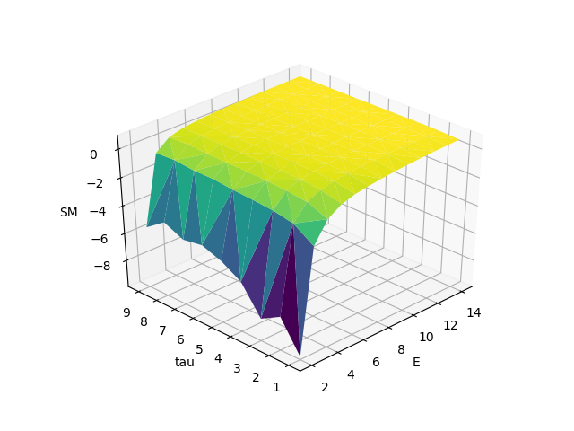

# Oil Price Prediction Project
## New Version

### Smoothness Measure
- daily
    
    
- weekly

    
- monthly
    
    
        

### Models to evaluate

-  GKFN

| Model  | kernel # | tau | E | SM |  RMSE | R Square |  MAE |
|---|:---:|:---:|:---:|:---:|:---:|:---:|:---:|
| Daily |  |  |  |  |  |  |  |
| *Weekly* | 85 | 1 | 7 | 0.039365 | 3.276904 | 0.973138 | 2.231803 |
| *Weekly (rolling forecast)* | 85 | 1 | 7 | 0.039365 | 2.770204 | 0.980803 | 2.037372 |
| *Monthly* | 99 | 1 | 6 | 0.104042 | 8.787111 | 0.803705 | 6.475776 |
| *Monthly (rolling forecast)*| 99 | 1 | 6 | 0.104042 | 6.999179 | 0.875459 | 5.527021 |
| Monthly (from weekly data, P = 4) | 22 | 4 | 5 | 0.062536 | 3.391234 | 0.971230 | 2.415184 |
| Monthly (from weekly data, P = 4, tau=1) | 43 | 1 | 10 | 0.131003 | 3.214682 | 0.974148 | 2.369253 |
| Monthly (from weekly data, recursive) | 37 | 1 | 6 | 0.039665 | 32.367137| -1.620753 | 27.356343 | 
| Weekly (from daily data, augmentation) | 21 | 1 | 6 | 0.223460 | 2.321455 | 0.986935 | 1.227982 |
| Monthly (from daily data, augmentation) | 17 | 1 | 5 | 0.086566 | 2.473987 | 0.985161 | 1.311006 |

- ARIMA

Hyperparameter settings

| Data  | constant(P,D,Q) | no_constant(P,D,Q)|
|---|:---:|:---:|
| Daily | (6,1,3) (3,1,1) | (5,1,3) (6,1,3) (1,1,3) |
| Weekly | (3,1,3) (4,1,3) (3,1,2) | (3,1,3) (4,1,3) (3,1,2) | 
| Monthly | (4,1,3) (1,1,3) (1,1,0) | (1,1,3) (1,1,0) |

Model Performance

| Model  | (P, D, Q) | RMSE | R Square |  MAE |
|---|:---:|:---:|:---:|:---:|
| Daily | (3,1,1)c | 2.15923827 | 0.988697 | 0.99930792 |
| Weekly | (3,1,3)nc | 2.45381585 | 0.98493735 | 1.69082969 |
| Monthly | (1,1,0)nc | 5.397045546 | 0.9259493015 | 4.20185773 |
